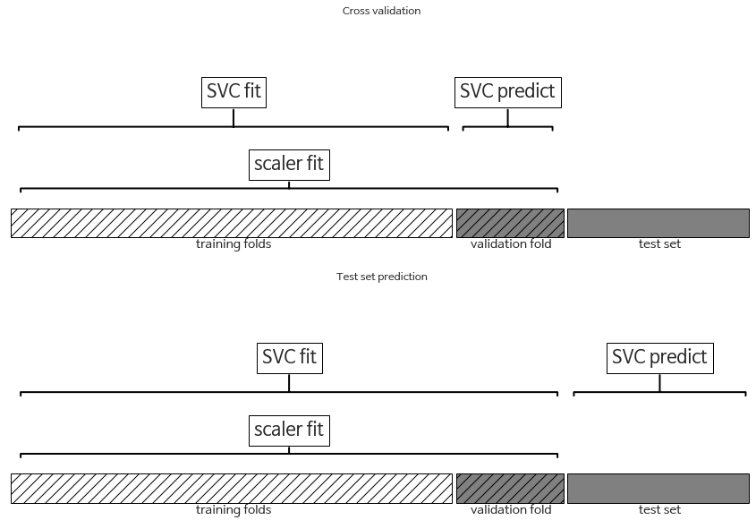

# 6. 알고리즘 체인과 파이프라인

### 데이터 전처리와 매개변수 선택

- 매개변수 선택 과정
    1. train, test 나눔
    2. train세트에 scaler 적용 후 test에도 적용
    3. train세트에 대해 gridsearch 사용하여 매개변수 서칭
    - 이 과정에서, 2번에서 교차 검증에 사용할 세트까지 모두 train세트에 포함되어버림
    - 검증세트가 이미 노출되었기때문에, 낙관적인 결과만 낳게 됨
    - 새로운 데이터셋에 대한 예측력 떨어짐
- 이 문제를 해결하기 위해선
    - 교차 검증의 분할이 모든 전처리 과정보다 앞서야함
    - train, test, val세트 있을 때 모든 데이터 처리 과정은 train에만 적용되어야함

- cross_val_score와 GridSearchCV를 이런 방식으로 구현하려면 **Pipeline**사용!
- **Pipeline**
    - 여러 처리 단계를 하나의 scikit-learn 추정기 형태로 묶어주는 파이썬 클래스
    - fit, predict, score 메서드 제공하며,
    - Pipeline을 사용하는 가장 이란적인 경우?
        - 분류기같은 지도학습 모델과, 데이터 스케일 조정과 같은 전처리 단계를 연결할 때

### 파이프라인 구축하기

- MinMaxScaler로 스케일 조정 후 SVM모델을 훈련시키는 워크플로우를 표현해보기
    1. 각 단계를 pipeline에 리스트로 전달
    2. 각 단계는 (객체, 객체 이름)의 튜플 형태로 전달
    3. 이후 fit 메서드를 활용해서 훈련 세트 피팅
    4. score 메서드로 테스트 세트 평가
        - 이 과정에서 test세트는 fit에서 훈련된 스케일러가 적용됨

    

- 코드의 양이 많이 줄어들었다.
- 하지만 가장 큰 장점은, 교차 검증이나 그리드서치에 파이프라인을 하나의 추정기처럼 사용할 수 있다는 점!

### 그리드 서치에 파이프라인 적용하기

1. 매개변수 그리드 정의
    - 정의 시, 각 매개변수가 어느 단계에서의 매개변수인지 설정해줘야함.
    - 매개변수 이름 앞에 svm_C와 같이 지정해줘야함
2. 이 매개변수 그리드와 파이프라인으로 GridSearchCV 객체 생성

    

- 훈련 세트에만 scaler가 학습한다. (윗그림)
    - 교차 검증의 각 분할에 scaler가 누설되지 않음

### 파이프라인 인터페이스

- 전처리, 분류 외에도 **(1) 특성 추출, (2) 특성 선택, (3) 스케일 변경, (4) 분류(회귀나 군집이 될 수도 있음)** 총 네 단계를 포함하는 파이프라인 만들 수 있음
- 마지막 단계(4)를 제외하고는 모두 transform 매서드를 가지고 있어야 함
- pipeline.fit 시 (1)~(3) 단계에서는 입력된 훈련 데이터에 대해 각각 fit_transform을 수행함
- 파이프라인 마지막 단계가 predict를 함수를 가져야 할 필요는 없음, 최소 fit만 있으면 됨.
    - 그래서 마지막 단계에 PCA메서드도 사용 가능

    

### make_pipeline을 사용한 파이프라인 생성

- make_pipeline함수는 각 단계 이름에 해당 파이썬 클래스 이름을 부여한 파이프라인을 만들어줌

    

### 단계 속성에 접근하기

- 파이프라인 단계 중 하나의 속성을 확인하고 싶을 때는?
- named_steps 속성 사용!

    

### 그리드 서치 안의 파이프라인 속성에 접근하기

- 위에서 사용한 named_steps를 활용해서 접근
    - 이후 coef_를 활용하여 입력 피처에 연결된 계수를 출력 가능

    

### 전처리와 모델의 매개변수를 위한 그리드 서치

- 파이프라인은 모든 처리 단계를 하나의 추정기로 캡슐화할 수 있음
- 또 다른 장점으로는, 지도학습의 출력을 이용하여 전처리 매개변수를 조정할 수 있다.

    

- 실제로 전처리 매개변수를 함께 돌리면 더 좋은 성능!

### 모델 선택을 위한 그리드 서치

- 파이프라인을 구성하는 단계도 탐색 대상으로 삼을 수 있음
    - 예를 들어, StandardScaler와 MinMaxScaler 중 어떤 것을 사용할지
    - 하지만 이러면 탐색의 범위가 더 넓어지므로 주의 필요
    - 모든 알고리즘을 시도해보는 것이 필수적인 머신러닝 전략은 아님

        
